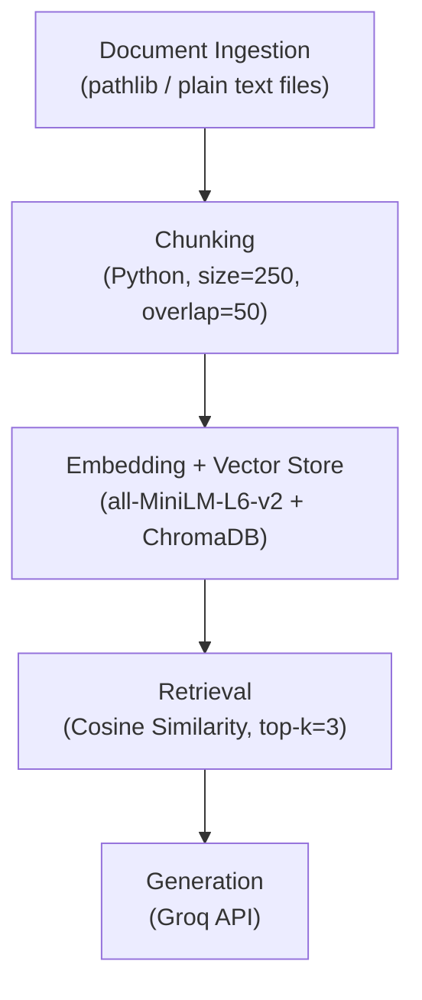

# Project 1 Planning: The Unofficial Guide

> Write this document before you write any pipeline code.
> Your spec and architecture diagram are what you'll use to direct AI tools (Claude, Copilot, etc.) to generate your implementation — the more specific they are, the more useful the generated code will be.
> Update the Retrieval Approach and Chunking Strategy sections if you change your approach during implementation.
> Update this file before starting any stretch features.

---

## Domain

Apartments in Seattle. Depending on where you look, rent prices and experiences can vary depending on what website you're looking, as well as the final negotiated prices by landlords. In addition, there may be additional fees or charges that aren't listed in the price everyone sees, or other problems.

---

## Documents

| # | Source | Description | URL or location |
|---|--------|-------------|-----------------|
| 1 | Zillow | A popular service for buying and renting apartments. | https://www.zillow.com/seattle-wa/ |
| 2 | Derby Boutique Apartments | Rent studio apartments near South Lake Union. | https://www.liveatderbyslu.com/ |
| 3 | Apartments | Another service for finding properties to rent. | https://www.apartments.com/seattle-wa/ |
| 4 | Craigslist | General website for buyers/renters to connect directly with sellers/landlords | https://seattle.craigslist.org/search/apa |
| 5 | Reddit | Seattle Housing for Redditors, of varying quality. | https://www.reddit.com/r/seattlehousing/ |
| 6 | Reddit | Pros and Cons of Living in Seattle | https://www.reddit.com/r/SeattleWA/comments/188kibg/the_pros_and_cons_of_living_in_seattle/ |
| 7 | Wikivoyage | Travel guide covering Seattle districts, getting around, and things to do | https://en.wikivoyage.org/wiki/Seattle |
| 8 | Facebook | Facebook group about Seattle | https://www.facebook.com/groups/150655681825/ |
| 9 | City-Data.com | Discussions of Neighborhoods, rents, and quality of life. | https://www.city-data.com/city/Seattle-Washington.html | 
| 10 | Teamblind | Public forum popular with tech workers with threads about Seattle | https://www.teamblind.com/ |

---

## Chunking Strategy

**Chunk size:** 10 sentences per chunk

**Overlap:** 3 sentences

**Reasoning:** Since the sources vary greatly in format (forum posts, listings, articles), sentence-aware chunking keeps semantic units intact rather than cutting mid-sentence. A 3-sentence overlap ensures context at chunk boundaries isn't lost — larger than the original 50-character overlap because sentences carry more meaning than raw character counts.

**Actual corpus size:** This configuration produces **1139 chunks** across all 10 sources (wikivoyage 232, city_data 203, reddit_housing 165, reddit_pros_cons 158, zillow 98, craigslist 85, facebook 85, apartments_com 50, teamblind 43, derby_slu 20). This is above the original ~200 target, but with top-k=3 a larger index just improves coverage rather than hurting retrieval. The cleaning step (`clean_docs.py`) drops City-Data's HMDA mortgage/loan-statistics tables, which were number-only rows irrelevant to apartment-living questions (city_data fell from 282 to 203 chunks). Cleaning iterates to a fixed point, so the corpus is deterministic — one `clean_docs.py` run produces the same output as many. Zillow comes from a structured listings export (`seattle_listings.json`) rather than scraped HTML — each of its 51 listings expands into specs, walkability, nearby schools, and a full description, so it now contributes 98 chunks instead of the 12 the bot-walled scrape yielded. The thinnest source, derby_slu, has only one property's worth of unit listings.

---

## Retrieval Approach

**Embedding model:** all-MiniLM-L6-v2

**Top-k:** 3

**Production tradeoff reflection:** For real users, I would choose the default embedding model as I think it's generally useful for those looking to live in Seattle for work or school. Multilingual support isn't something I'm considering since that introduces complexity for querying and the storage and document requirements to support additional languages would explode.

---

## Evaluation Plan

| # | Question | Expected answer |
|---|----------|-----------------|
| 1 | What is one university in Seattle? | University of Washington |
| 2 | What are some of the biggest tech companies in Seattle? | Microsoft, Google, Amazon, Meta |
| 3 | How many people live in Seattle? | About at least 750,000. |
| 4 | Is Seattle a walkable city? | Yes. |
| 5 | What state is Seattle in? | Washington |

---

## Anticipated Challenges

1. Chunks not properly separating text in a logical manner, giving the model incomplete or unrelated information.

2. The model not using the information provided via the embeddings.

---

## Architecture

<!-- Draw a diagram of your pipeline showing the five stages:
     Document Ingestion → Chunking → Embedding + Vector Store → Retrieval → Generation
     Label each stage with the tool or library you're using.
     You can use ASCII art, a Mermaid diagram, or embed a sketch as an image.
     You'll use this diagram as context when prompting AI tools to implement each stage. -->

---

## AI Tool Plan

<!-- For each part of the pipeline below, describe:
     - Which AI tool you plan to use (Claude, Copilot, ChatGPT, etc.)
     - What you'll give it as input (which sections of this planning.md, which requirements)
     - What you expect it to produce
     - How you'll verify the output matches your spec

     "I'll use AI to help me code" is not a plan.
     "I'll give Claude my Chunking Strategy section and ask it to implement chunk_text()
     with my specified chunk size and overlap" is a plan. -->

I'll use Claude Code as it is what I currently have for CodePath.
1. Document Ingestion
  - For Document Ingestion, I'll have the model first attempt to write up a file to download the text directly, via BeautifulSoup or other optimal library, depending on the source. If the contents are gated behind a login wall or the model is blocked from accessing the data, I'll need to brainstorm a quick solution to getting around it, via user agent spoofing or manually obtaining the information. Each document(s) would reside in their own folder, representing the source data. There should be at least 10 document folders.
2. Chunking
  - The model will chunk the information with some overlap and prepare them for storing.
3. Embedding + Vector Store
  - Wire up a solution that feeds the chunks with metadata to the database using an embedding model.
4. Retrieval
  - Implement a simple GUI interface with a box for inserting user messages and a box to get what chunks were retrieved. Test a user prompt and see what the retrieved chunks are from the vector database.
5. Generation
  - Run using OpenAI's OSS 20B model powered by Groq with information from ChromaDB. Add a text box to see what the model's outputs are. Use a minimal system prompt.

**Milestone 3 — Ingestion and chunking:**

**Milestone 4 — Embedding and retrieval:**

**Milestone 5 — Generation and interface:**
